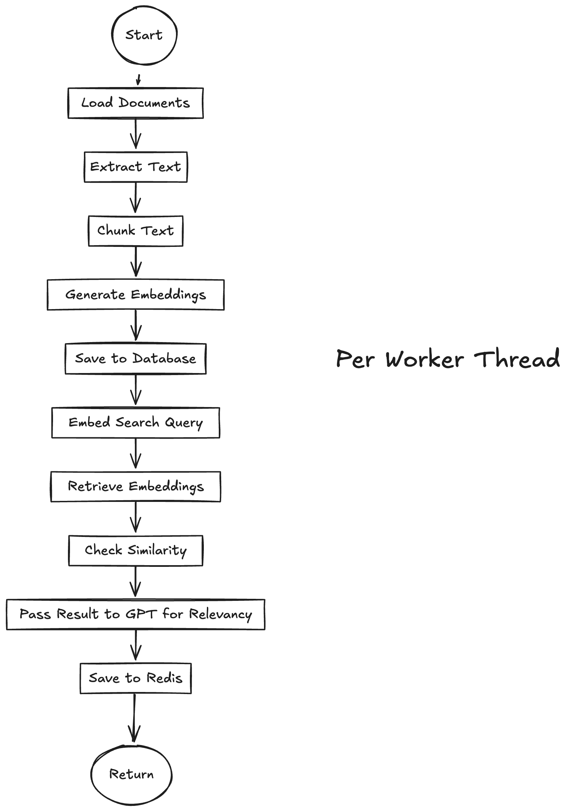

# PDF Search Challenge





A Next.js application for searching and analyzing PDF documents using Supabase and LangChain.

## Features

- PDF document search and processing
- Server-side rendering with Next.js App Router
- PDF text extraction and analysis
- Preview functionality for PDFs

## Prerequisites

- Node.js 18+ or Bun
- A Supabase account and project
- Vercel account (for deployment)
- Open AI Account

## Local Development Setup

1. Clone the repository:
   ```bash
   git clone https://github.com/pranavnanaware/pdf-search.git
   cd pdf-search
   ```

2. Install dependencies:
   ```bash
   # Using npm
   npm install
   
   # Using Bun
   bun install
   ```

3. Create a `.env.local` file in the root directory with the following variables:
   ```
   # Supabase Configuration
   NEXT_PUBLIC_SUPABASE_URL=
   NEXT_PUBLIC_SUPABASE_ANON_KEY=
   GOOGLE_SEARCH_API_KEY=
   GOOGLE_SEARCH_ENGINE_ID=
   OPENAI_API_KEY=

   REDIS_URL=
   ```

4. Generate Supabase types:
   ```bash
   npm run generate:types
   ```

5. Start the development server:
   ```bash
   # Using npm
   npm run build:workers
   npm run dev
   
   # Using Bun
   bun build:workers
   bun dev
   ```

6. Visit `http://localhost:3000` to see the application.

## Building for Production

1. Build the application:
   ```bash
   npm run build
   ```

2. Start the production server:
   ```bash
   npm run start
   ```

## Deploying to Vercel

1. Push your code to a GitHub repository.

2. Go to [Vercel](https://vercel.com) and create a new project.

3. Import your GitHub repository.

4. Configure the following environment variables in your Vercel project settings:
   - `NEXT_PUBLIC_SUPABASE_URL`
   - `NEXT_PUBLIC_SUPABASE_ANON_KEY`
   - `GOOGLE_SEARCH_API_KEY`
   - `GOOGLE_SEARCH_ENGINE_ID`
   - `OPENAI_API_KEY`
   - `REDIS_URL` 

5. Deploy the project.

## Project Structure

```
├── app/                 # Next.js app directory
├── components/         # React components
├── lib/               # Utility functions and configurations
├── scripts/           # Build and utility scripts
├── supabase/         # Supabase configuration and migrations
├── types/            # TypeScript type definitions
└── public/           # Static assets
```

## Available Scripts

- `npm run dev` - Start development server
- `npm run build` - Build for production
- `npm run start` - Start production server
- `npm run build:workers` - Build worker scripts
- `npm run generate:types` - Generate Supabase types
- `npm run test-pdf` - Test PDF processing

## Dependencies

- Next.js - React framework
- Supabase - Backend and authentication
- LangChain - AI/ML processing
- Tailwind CSS - Styling
- shadcn/ui - UI components
- PDF.js - PDF processing

## Contributing

1. Fork the repository
2. Create your feature branch (`git checkout -b feature/amazing-feature`)
3. Commit your changes (`git commit -m 'Add some amazing feature'`)
4. Push to the branch (`git push origin feature/amazing-feature`)
5. Open a Pull Request

## License

This project is licensed under the MIT License - see the LICENSE file for details.
